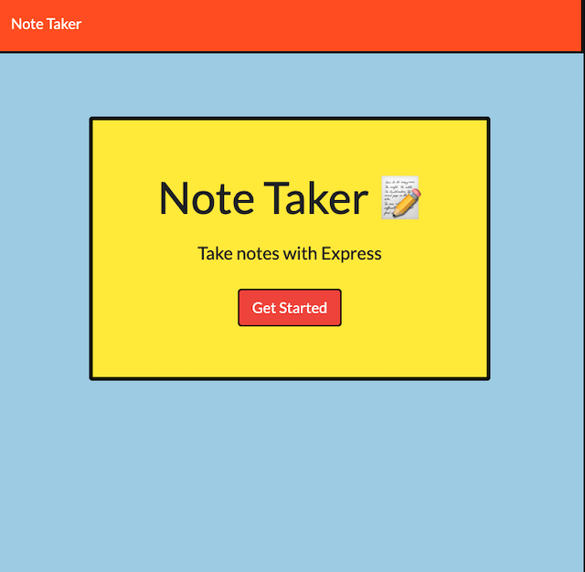
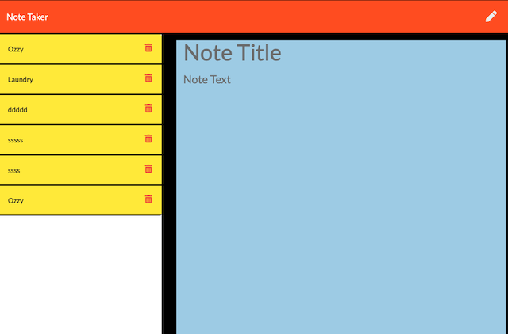

# Note-Taker
This application lets you input, store, retrieve and delete important notes - or just random thoughts - in one groovy place.

# Table of Contents
- [Description](#Description)
- [Technologies](#Technologies)
- [Installation](#Installation)
- [Usage](#Usage)
- [Repositories](#Repositories)
- [Deployment](#Deployment)
- [Screenshots](#Screenshots)

## Description
The application demonstrates creating a server-side API using the Express.js framework to establish API routes associated with HTTP request methods of `get`, `post`, and `delete`. 

The Note Taker allows a user to enter, save, retrieve, and delete notes. 

## Technology
Technologies utilized include
- Express.js
- Node.js
- Javascript
- HTML & CSS
- uuid package from npm
- Heroku

## Installation
To runs this application you must have Node.js installed. Once installed:
1. Download the application files
2. In the terminal, navigate to this file folder and install the required dependencies listed in the package.json file by entering `npm install` or `npm i` and `ENTER`.
3. Once "installed", be sure that `Express.js` and `uuid` (a unique id generator from npm) are now in the added  `node_modules` folder.

## Usage
1. Once the above installation steps have been completed, right click on the `server.js` and `Open in an internal/external terminal`
2. The application is launched by typing `node server.js` in the terminal.
3. NOTE: If you're new to using backend servers remember: `Ctrl C` at an active server prompt will "end/kill" the server connection when/if necessary.

## Repository
- GitHub Repo/Code: https://github.com/jenneration/

## Deployment
- Heroku URL:https://safe-headland-22717.herokuapp.com/

## Screenshots

 